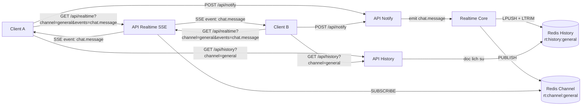
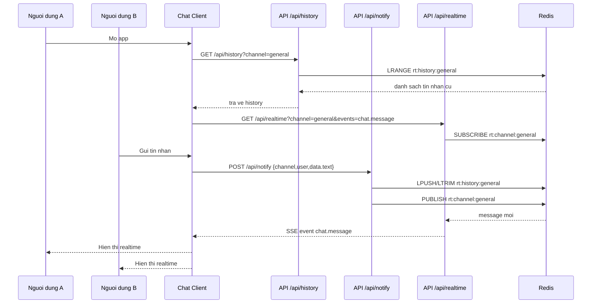

# Realtime Chat (Upstash-Style, No Upstash SDK)

This project follows the same flow as Upstash Realtime quickstart, but uses local code with `ioredis`.

## Quickstart

1. Set env values:

```env
REDIS_URL="rediss://default:<password>@<redis-host>:<port>"
```

1. Run:

```bash
npm install
npm run dev
```

1. Open [http://localhost:3000](http://localhost:3000)

## API Shape (similar to docs)

- `src/lib/realtime.ts`
  - `realtime.emit(event, data, { channel })`
  - `realtime.history(channel, limit)`
- `src/lib/realtime-handler.ts`
  - `handle({ realtime })` for SSE route handler
- `src/lib/realtime-client.tsx`
  - `RealtimeProvider`
  - `createRealtime<Events>()`

## Routes

- `GET /api/realtime`
  - Query:
    - `channel=general`
    - `events=chat.message`
  - Streams SSE events.
- `POST /api/notify`
  - Body:
    - `{ channel, user, data: { text } }`
  - Emits `chat.message`.
- `GET /api/history?channel=general`
  - Loads message history.

## Project Structure

```txt
src/
  app/
    api/realtime/route.ts      # GET = handle({ realtime })
    api/notify/route.ts        # emit("chat.message", ...)
    api/history/route.ts       # history endpoint
    providers.tsx              # wraps app with RealtimeProvider
    chat-client.tsx            # useRealtime(...) + send message
  lib/
    realtime.ts                # local Realtime class + typed events
    realtime-handler.ts        # SSE handler factory
    realtime-client.tsx        # RealtimeProvider + createRealtime hook
    realtime-app.ts            # typed useRealtime export
    redis.ts                   # ioredis publisher/subscriber
```

## Notes

- This is HTTP + Redis Pub/Sub + SSE.
- No Upstash runtime package is used.
- Behavior mirrors docs: typed event names, provider + hook, `GET /api/realtime`.







